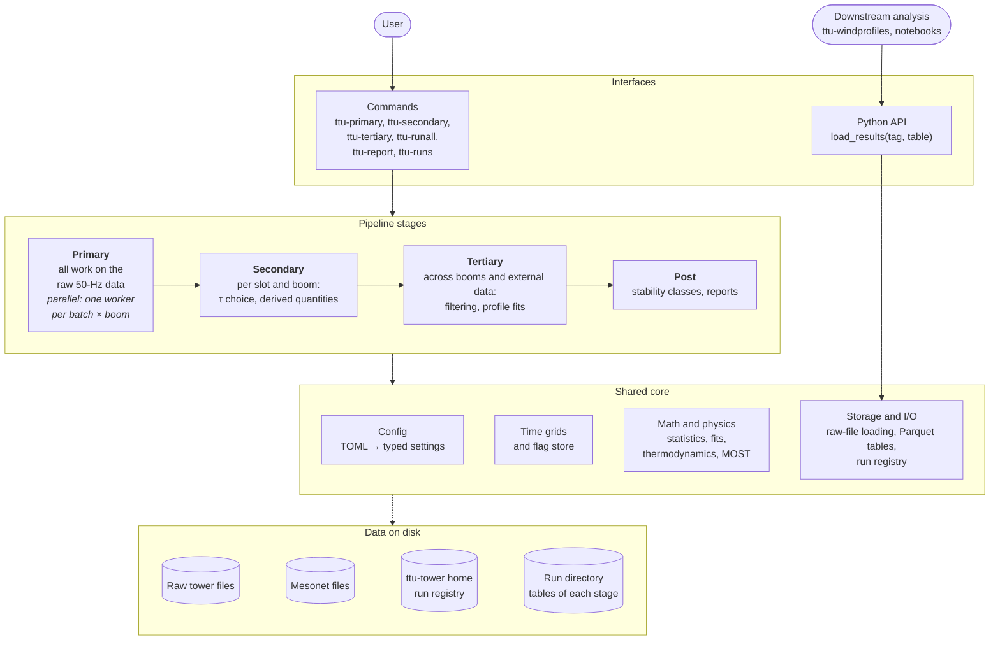
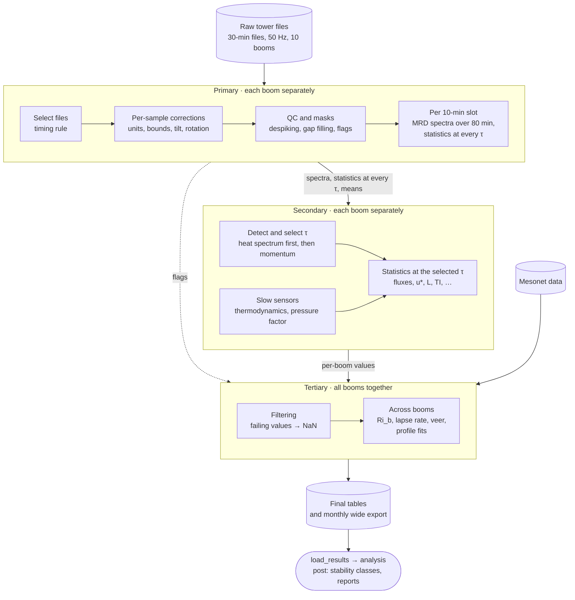
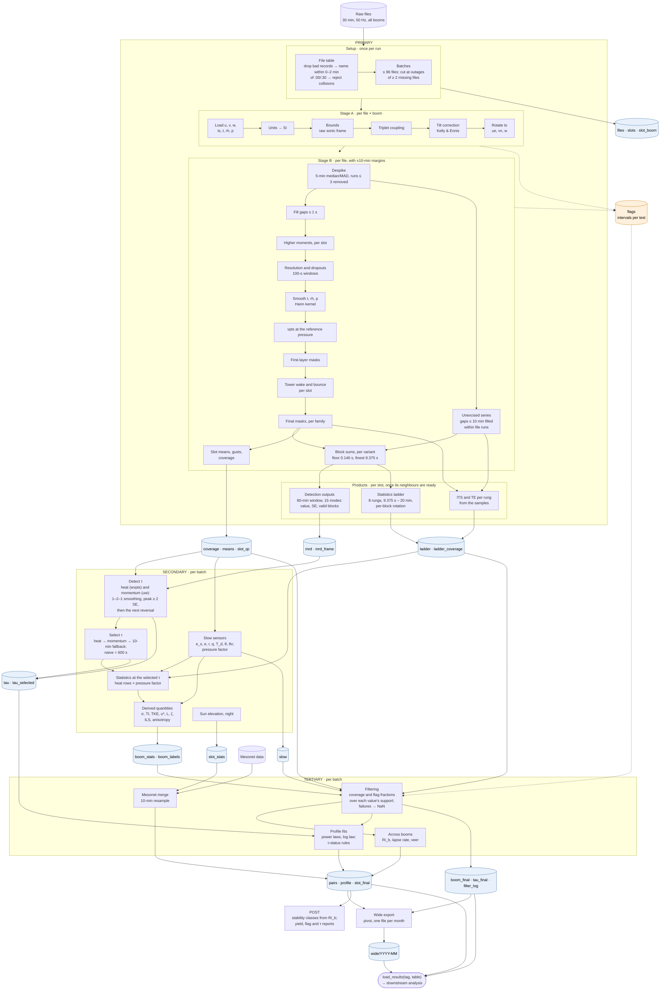

# Design overview

A summary of the pipeline and diagrams of it, for review and later reference. They restate the
specification in the other documents of this folder and add nothing to it; if a diagram and a
specification disagree, the specification wins.

## Summary

`ttu-tower-processing` 2.0.0 turns a year (Nov 2013 – Oct 2014) of 50-Hz sonic anemometer and
slow-sensor data from the ten booms of the TTU 200-m tower into quality-controlled 10-minute
turbulence statistics for each boom, cross-boom profile quantities, and the flags and
diagnostics behind them. It replaces `old-tower-processing`.

**The averaging time is chosen from the data, per slot and boom.** Each 10-minute slot gets
multiresolution (MRD) cospectra computed over an 80-minute window centered on it. The gap
between turbulence and slower, non-turbulent motion (mesoscale, or submesoscale in stable
conditions) in the heat cospectrum (or else the momentum cospectrum) sets the averaging time τ,
on a power-of-two ladder from 9.4 s to 20 min. Statistics then average over τ-long blocks, so
they keep the turbulent flux and exclude the non-turbulent contribution. Two comparison
versions come alongside: a fixed 10-minute average (`naive`), and one computed without excising
flagged data (`mrd_unexcised`).

**Three stages, each rerunnable on its own:**
- **Primary** is the only stage that reads the 50-Hz data. It selects files by a timing rule,
  applies per-sample corrections (units, bounds, tilt, rotation), runs quality control, and
  computes, per slot, the MRD spectra and the statistics at every τ on the ladder. It never
  chooses τ, so every τ decision can be retuned by rerunning the fast later stages.
- **Secondary** detects τ in each cospectrum (Vickers & Mahrt's rule plus a significance test
  on the peak), selects one τ per slot, boom and variant, and computes the statistics at that
  τ and the quantities derived from them (u*, L, TI, TKE, integral scales, anisotropy). It also
  computes slow-sensor thermodynamics and converts heat quantities to the measured pressure.
- **Tertiary** filters values by their flags and coverage (a failing value becomes NaN; whole
  records are never dropped), merges mesonet data, and computes cross-boom quantities (Ri_b,
  lapse rate, veer) and profile fits. **Post** helpers classify stability and report yields.

**Quality control** runs each test once, at its own grain, and stores the result as intervals
of sample indices, so any later window can ask what fraction of it was flagged. Unusable
samples are excised rather than interpolated (only gaps of 1 s or less are filled), and a block
or window counts only if at least 75% of it is usable. Slot-level tests remove data in the
tower's wake and signal bounce before they can reach τ detection.

**Processing:** primary runs (batch, boom) work units in parallel, streaming each boom's files
with 10-minute margins, so results don't depend on where files or batches are split. Every slot
of the period is emitted with a status. One TOML file configures a run, and per-stage config
hashes guard reruns. Results go to a run directory registered in the user's ttu-tower home
(`~/.ttu-tower`) and are loaded by run tag with `ttu_tower.load_results`. Outputs are tidy long
Parquet tables, plus a wide export written one file per month.

## Architecture

### Overview

The main parts of the system and how they depend on each other. Solid arrows mean "uses";
dotted arrows mean "reads or writes".

### In detail

Every module of the package (plan.md §2.2), grouped by package, each band starting from the
command that drives it. Solid arrows mean "calls"; dotted arrows mean "reads or writes" (between
bands: reads the previous stage's tables); the thick arrow is primary's process pool. Every
package also uses the shared core, the libraries and `io/`; those arrows are left out to keep
the diagram readable.

```mermaid
flowchart TB
    runall(["ttu-runall<br/>runs the three stages in order,<br/>as subprocesses"])

    subgraph b_primary["primary/"]
        direction LR
        c_primary(["ttu-files<br/>ttu-primary"])
        p_runner["runner.py<br/>register run, hash guard,<br/>file table, manifest, resume"]
        p_partition["partition.py<br/>batches and outages"]
        p_stream["stream.py<br/>rolling buffer over<br/>one batch × boom"]
        p_stage_a["stage_a.py<br/>units, bounds, coupling,<br/>tilt, rotation"]
        p_stage_b["stage_b.py<br/>one file with<br/>±10-min margins"]
        p_ops["despike.py · gaps.py<br/>qc_windows.py · slow.py<br/>masks.py · blocks.py<br/>slotstats.py"]
        p_products["products.py<br/>per-slot outputs"]
        p_calc["mrd.py · ladder.py<br/>rawrung.py"]
        c_primary --> p_runner --> p_partition
        p_runner ==>|"spawn pool: one task<br/>per batch × boom"| p_stream
        p_stream --> p_stage_a
        p_stream --> p_stage_b --> p_ops
        p_stream --> p_products --> p_calc
    end

    subgraph b_secondary["secondary/"]
        direction LR
        c_secondary(["ttu-secondary"])
        s_runner["runner.py<br/>batches in sequence"]
        s_detect["detect.py<br/>τ per cospectrum"]
        s_select["select.py<br/>one τ per slot,<br/>boom, variant"]
        s_slow["slow.py<br/>thermodynamics,<br/>pressure factor"]
        s_derived["derived.py<br/>selected-τ statistics,<br/>derived quantities"]
        s_sun["sun.py<br/>sun elevation, night"]
        c_secondary --> s_runner --> s_detect --> s_select --> s_derived
        s_runner --> s_slow --> s_derived
        s_runner --> s_sun
    end

    subgraph b_tertiary["tertiary/"]
        direction LR
        c_tertiary(["ttu-tertiary"])
        t_runner["runner.py<br/>batches in sequence"]
        t_meso["mesonet.py<br/>merge, 10-min resample"]
        mesodir[("Mesonet<br/>directory")]
        t_filter["filtering.py<br/>flags and coverage → NaN"]
        t_multi["multiboom.py<br/>Ri_b, lapse rate, veer"]
        t_prof["profiles.py<br/>power-law and log-law fits"]
        t_wide["wide.py<br/>monthly wide export"]
        c_tertiary --> t_runner --> t_meso -.->|"wtxmeso"| mesodir
        t_runner --> t_filter --> t_multi
        t_filter --> t_prof
        t_runner --> t_wide
    end

    subgraph b_tools["Reports, validation, results"]
        direction LR
        c_report(["ttu-report"])
        p_report["primary/report.py<br/>QC and yield CSVs"]
        po_report["post/report.py<br/>stability reports"]
        po_classify["post/classify.py<br/>stability classes"]
        c_validate(["ttu-validate"])
        v_checks["validation/checks.py<br/>first-run checks"]
        v_synth["validation/synthetic.py<br/>synthetic data"]
        c_runs(["ttu-runs"])
        downstream(["Downstream<br/>analysis"])
        api["results.py<br/>load_results, find_run,<br/>list_runs"]
        c_report --> p_report
        c_report --> po_report --> po_classify
        c_validate --> v_checks --> v_synth
        c_runs --> api
        downstream --> api
    end

    subgraph b_core["Shared core"]
        direction LR
        k_config["config/<br/>TOML → frozen<br/>dataclasses, hashes"]
        k_const["constants.py<br/>site, booms,<br/>tilt tables"]
        k_time["timegrid.py<br/>indices,<br/>block sums"]
        k_flags["flags.py<br/>test registry,<br/>FlagStore"]
        k_schema["schema.py<br/>table<br/>definitions"]
        k_logs["logs.py<br/>queue logging"]
        k_config ~~~ k_const ~~~ k_time ~~~ k_flags ~~~ k_schema ~~~ k_logs
    end

    subgraph b_lib["Libraries: pure functions, no pipeline knowledge"]
        direction LR
        k_math["math/<br/>polar, stats, fits"]
        k_phys["physics/<br/>constants, thermo, most,<br/>richardson, turbulence, earth"]
        k_phys -->|"uses"| k_math
    end

    subgraph b_io["io/ and data on disk"]
        direction LR
        c_convert(["ttu-convert-parquet"])
        i_convert["convert.py<br/>raw → Parquet"]
        i_raw["rawfiles.py<br/>names, timing rule"]
        i_load["load.py<br/>one boom's columns"]
        i_store["store.py<br/>fragments, manifests,<br/>read_table"]
        i_runs["runs.py<br/>ttu-tower home,<br/>run registry"]
        rawdir[("Raw directory<br/>Parquet; zip/csv<br/>with a flag")]
        rundir[("Run directory<br/>primary/ secondary/<br/>tertiary/ reports/")]
        home[("ttu-tower home<br/>signature, runs/TAG.json,<br/>results/")]
        c_convert --> i_convert -.-> rawdir
        i_raw -.-> rawdir
        i_load -.-> rawdir
        i_store -.-> rundir
        i_runs -.-> home
    end

    runall -.->|"subprocess"| b_primary
    b_primary -.->|"tables"| b_secondary
    b_secondary -.->|"tables"| b_tertiary
    b_tertiary ~~~ b_tools
    b_tools ~~~ b_core
    b_core ~~~ b_lib
    b_lib ~~~ b_io
```

## Data flow

### Overview

What happens to the data, stage by stage. Solid arrows carry the main data; the dotted arrow
carries the QC flags that tertiary filtering uses.

### In detail

Every processing step and every output table (output-schema.md). Rectangles are steps; cylinders
are tables written to the run directory (the flag table in orange). Solid arrows carry data;
dotted arrows carry QC flags.

